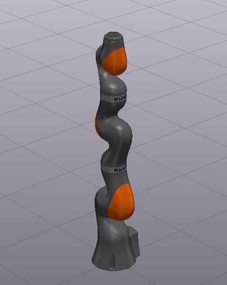

# Inverse Dynamics Control on fully-actuated KUKA arm



### Why Inverse Dynamics Control, why not PID?

Why not use PID controller? That's a good question. If the robot's joints are decouples and using PID controller for each joint is the way to go. All you need is model-free parameters that corresponds to each joint. In my case, I am simulating a humanoid robot with two arms, the joints and links are deeply coupled that model-free method does not work well here.

The [Inverse Dynamics Controller](https://drake.mit.edu/doxygen_cxx/classdrake_1_1systems_1_1controllers_1_1_inverse_dynamics_controller.html#details) is a system block that takes in the desired acceleration and spit out whatever the generalized control force is. Using Inverse Dynamics Controller is easy in Drake because `MultibodyPlant` does all the inverse dynamics calculation for you.

### Code

Create a folder _drake/examples/kuka\_iiwa\_arm\_idc/_

```text
cd drake
mkdir -p examples/kuka_iiwa_arm_idc
```

Put the following file into the folder.


```cpp
/// @file
///
/// This demo sets up a kuka arm simulation.
/// An inverse dynamics controller was created to control the robot to
/// the desired system state.

#include <gflags/gflags.h>

#include "drake/common/drake_assert.h"
#include "drake/common/find_resource.h"
#include "drake/common/text_logging_gflags.h"
#include "drake/common/type_safe_index.h"
#include "drake/geometry/geometry_visualization.h"
#include "drake/geometry/scene_graph.h"
#include "drake/lcm/drake_lcm.h"
#include "drake/multibody/parsing/parser.h"
#include "drake/multibody/plant/multibody_plant.h"
#include "drake/multibody/tree/weld_joint.h"
#include "drake/systems/analysis/simulator.h"
#include "drake/systems/controllers/inverse_dynamics_controller.h"
#include "drake/systems/framework/diagram.h"
#include "drake/systems/framework/diagram_builder.h"
#include "drake/systems/primitives/constant_vector_source.h"

namespace drake {
namespace examples {
namespace kuka {

using drake::multibody::MultibodyPlant;

DEFINE_double(simulation_time, 5,
              "Desired duration of the simulation in seconds");
DEFINE_double(max_time_step, 1.0e-3,
              "Simulation time step used for integrator.");
DEFINE_double(target_realtime_rate, 1,
              "Desired rate relative to real time.  See documentation for "
              "Simulator::set_target_realtime_rate() for details.");

DEFINE_bool(add_gravity, true,
            "Indicator for whether terrestrial gravity"
            " (9.81 m/s²) is included or not.");

DEFINE_double(Kp, 10.0, "Kp");
DEFINE_double(Ki, 0.1, "Ki");
DEFINE_double(Kd, 5.0, "Kd");

void DoMain() {
  DRAKE_DEMAND(FLAGS_simulation_time > 0);

  systems::DiagramBuilder<double> builder;

  geometry::SceneGraph<double>& scene_graph =
      *builder.AddSystem<geometry::SceneGraph>();
  scene_graph.set_name("scene_graph");

  MultibodyPlant<double>& plant =
      *builder.AddSystem<MultibodyPlant>(FLAGS_max_time_step);
  plant.RegisterAsSourceForSceneGraph(&scene_graph);
  std::string full_name = FindResourceOrThrow(
      "drake/manipulation/models/"
      "iiwa_description/sdf/iiwa14_no_collision.sdf");

  multibody::ModelInstanceIndex plant_index =
      multibody::Parser(&plant).AddModelFromFile(full_name);

  // Weld the hand to the world frame.
  const auto& joint_arm_root = plant.GetBodyByName("iiwa_link_0");
  plant.AddJoint<multibody::WeldJoint>("weld_arm", plant.world_body(), nullopt,
                                       joint_arm_root, nullopt,
                                       Isometry3<double>::Identity());

  if (!FLAGS_add_gravity) {
    plant.mutable_gravity_field().set_gravity_vector(Eigen::Vector3d::Zero());
  }

  // Now the model is complete.
  plant.Finalize();

  // Defind desired states, here we choose 0 positions and 0 velocities.
  VectorX<double> desired_state =
      VectorX<double>::Zero(plant.num_multibody_states());
  auto desired_state_source =
      builder.AddSystem<systems::ConstantVectorSource<double>>(desired_state);
  desired_state_source->set_name("constant_source");

  drake::log()->info(
      "positions numbers: " + std::to_string(plant.num_positions()) +
      ", velocities numbers: " + std::to_string(plant.num_velocities()) +
      ", actuators numbers: " + std::to_string(plant.num_actuators()));

  // Create inverse dynamics controller.
  const int U = plant.num_actuators();
  auto IDC =
      builder
          .AddSystem<systems::controllers::InverseDynamicsController<double>>(
              plant, Eigen::VectorXd::Ones(U) * FLAGS_Kp,
              Eigen::VectorXd::Ones(U) * FLAGS_Ki,
              Eigen::VectorXd::Ones(U) * FLAGS_Kd, false);
  builder.Connect(IDC->get_output_port_control(),
                  plant.get_applied_generalized_force_input_port());
  builder.Connect(plant.get_state_output_port(),
                  IDC->get_input_port_estimated_state());
  builder.Connect(desired_state_source->get_output_port(),
                  IDC->get_input_port_desired_state());

  // Constant zero load for plant actuation_input_port.
  auto constant_zero_torque =
      builder.AddSystem<systems::ConstantVectorSource<double>>(
          Eigen::VectorXd::Zero(plant.num_actuators()));
  builder.Connect(constant_zero_torque->get_output_port(),
                  plant.get_actuation_input_port());

  DRAKE_DEMAND(!!plant.get_source_id());
  builder.Connect(
      plant.get_geometry_poses_output_port(),
      scene_graph.get_source_pose_port(plant.get_source_id().value()));
  builder.Connect(scene_graph.get_query_output_port(),
                  plant.get_geometry_query_input_port());

  geometry::ConnectDrakeVisualizer(&builder, scene_graph);
  std::unique_ptr<systems::Diagram<double>> diagram = builder.Build();

  // Create a context for this system.
  std::unique_ptr<systems::Context<double>> diagram_context =
      diagram->CreateDefaultContext();
  diagram->SetDefaultContext(diagram_context.get());

  systems::Context<double>& plant_context =
      diagram->GetMutableSubsystemContext(plant, diagram_context.get());
  Eigen::VectorXd q = plant.GetPositions(plant_context, plant_index);
  q[0] = 0.1;
  q[1] = 0.5;
  q[2] = 0.3;
  plant.SetPositions(&plant_context, q);

  // Set up simulator.
  systems::Simulator<double> simulator(*diagram, std::move(diagram_context));
  simulator.set_publish_every_time_step(true);
  simulator.set_target_realtime_rate(FLAGS_target_realtime_rate);
  simulator.Initialize();
  simulator.AdvanceTo(FLAGS_simulation_time);
}

}  // namespace kuka
}  // namespace examples
}  // namespace drake

int main(int argc, char* argv[]) {
  gflags::SetUsageMessage(
      "bazel run"
      "//examples/kuka_iiwa_arm_idc:run_kuka_idc");
  gflags::ParseCommandLineFlags(&argc, &argv, true);
  drake::examples::kuka::DoMain();
  return 0;
}
```


Add `BUILD.bazel`


```text
load(
    "@drake//tools/skylark:drake_cc.bzl",
    "drake_cc_binary",
)

package(
    default_visibility = [":__subpackages__"],
)

drake_cc_binary(
    name = "run_kuka_idc",
    srcs = ["run_kuka_idc_demo.cc"],
    data = [
        "//manipulation/models/iiwa_description:models",
    ],
    deps = [
        "//common:find_resource",
        "//common:text_logging_gflags",
        "//common:type_safe_index",
        "//geometry:geometry_visualization",
        "//lcm",
        "//multibody/parsing",
        "//multibody/plant",
        "//systems/analysis",
        "//systems/controllers",
        "//systems/primitives:constant_vector_source",
        "@gflags",
    ],
)
```


### Run demo

```text
bazel-bin/tools/drake_visualizer &
bazel run //examples/kuka_iiwa_arm_idc:run_kuka_idc
```

### Links

The complete code is [here](https://github.com/guzhaoyuan/drake/tree/tutorial/examples/kuka_iiwa_arm_idc).

Similar demo is [kinova jaco arm set pose control](https://github.com/guzhaoyuan/drake/blob/tutorial/examples/kinova_jaco_arm/run_setpose_jaco_demo.cc).

```text
bazel-bin/tools/drake_visualizer &
bazel run //examples/kinova_jaco_arm:run_setpose_jaco_demo
```

