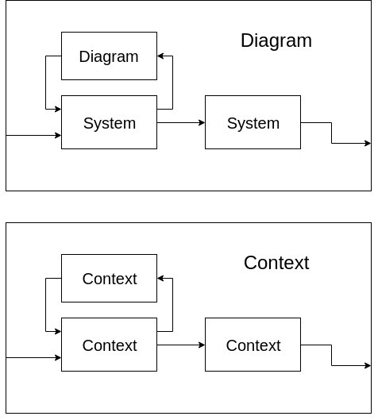

# Drake Concepts

Drake's core library has 3 big parts:

### I. Dynamical Systems Modeling

Drake provides tools to model the physics of a dynamic system, which can be used for analysis and simulation.

#### System

Drake's system modeling works like Matlab Simulink. Drake constructs complex systems from blocks called `system`. `system` has input/output ports that could be connected with other systems. **A `system` block can be a `diagram` or a `leafsystem`.** `leafsystem` is the minimum build block and a `diagram` is composed of multiple `leafsystem` or `diagram`.

`leafsystem` functions as basic components in robotics systems, like signals, sensors, controllers, planners, etc.

#### Diagram

Drake uses `diagram` to represent systems that internally have several connected systems that function as a whole. `diagram` itself is a system and can be nested. The root diagram contains all the sub-systems and sub-diagrams.

Systems can be connected through their input/output ports. Connected systems could also be formed into a `diagram`.

#### Context

`context` is data of system states and parameters cached in a separate place. Each `diagram` and each `system` has its own `context`. The `context` and the `diagram` are the only two information a `simulator` needs to simulate. Given the `context`, all methods called on a `system` should be completely deterministic and repeatable \(ref. [Underactuated Robotics textbook](http://underactuated.csail.mit.edu/underactuated.html?chapter=systems)\).

Drake has method `diagram->CreateDefaultContext()` which creates the context with default values for all the subsystems. Values in the context, such as the initial state and the initial time, can be independently set before the simulation begins.

A context can have continuous state, discrete state, and abstract variable. Based on the variable type, the simulator would update the context data by either numerically integrating the continuous derivative or [updating the states using state-space dynamics](https://drake.mit.edu/doxygen_cxx/group__discrete__systems.html).

#### Simulation

Drake is a simulation software. The Drake `simulator` takes in the system `diagram` together with its `context`, to simulate by updating parameters such as integral continuous state derivatives, compute discrete state updates, allocates the various outputs of a `system`, etc.

### II. Mathematical Programs Solving

Drake incorporates famous and useful optimization tools, for example, Gurobi, SNOPT, IPOPT, SCS, MOSEK. These tools help to solve mathematical problems in robotics, such as motion planning and control.

To use Mathematical Programming, there is a [very good starting point](https://colab.research.google.com/github/RussTedrake/underactuated/blob/master/src/mathematical_program_examples.ipynb) written in python. The same idea applies to C++.

### III. Multibody Kinematics and Dynamics

Multibody means multiple rigid bodies connected in a tree structure. The root `diagram` that contains a unique `leafsystem` named`MultibodyPlant` is considered as a robotic system. `MultibodyPlant` internally uses rigid body tree algorithms to compute the robot kinematics, dynamics, jacobian, etc. 

`MultibodyPlant` is a `system`. So it has input/output ports that could be connected to other systems like controllers and visualizers.

## Tools that Drake uses

### 1. Eigen

[Eigen](http://eigen.tuxfamily.org/index.php?title=Main_Page) is a C++ library with linear algebra operations and algorithms.

#### AutoDiff

A convenient technique to compute Derivative. Computing Integral is trivial and computing Derivative is non-trivial. AutoDiff is a good solution that Eigen provides to solve the derivative.

### 2. Lightweight Communications and Marshalling \(LCM\)

LCM is a multi-process communication tool. LCM is everywhere in Drake. It serves as the bridge between system ports, so all the communications between systems are transported using LCM, which can be inspected by LCM spy tool.



### 3. Tinyxml2

A handy tool that parses XML files, enables Drake to parse URDF and SDF, thus creating `MultibodyPlant` for simulation.

### 4. The Visualization Toolkit \(VTK\)

Drake uses [VTK](https://vtk.org/) as a geometry rendering tool. The Drake visualizer communicates with the simulator through LCM.

